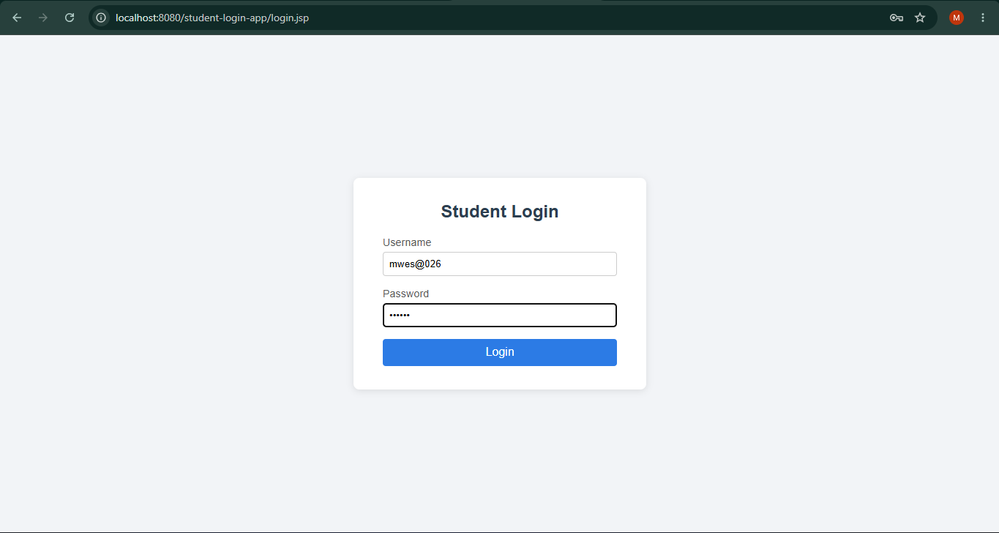
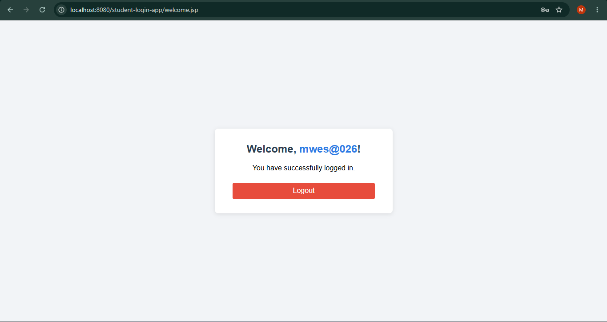

# Student Login System (Servlets + JSP)

A minimal Student Login web app demonstrating session management with Java Servlets and JSP.

## Features

- `login.jsp` — username/password form, styled via a shared design-system stylesheet (`assets/css/style.css`).
- `LoginServlet` — validates that username (and password) are not empty, creates an `HttpSession`, and stores the username in it.
- `welcome.jsp` — protected page that reads the username from the session and displays a welcome message; redirects to `login.jsp` if there's no active session.
- `LogoutServlet` — invalidates the session and redirects back to `login.jsp`.
- Output is escaped with JSTL (`<c:out>`) to prevent XSS.

## Tech Stack

- Jakarta Servlet 6.0 / JSP, JSTL
- Maven (packaged as a WAR)
- Tomcat 11

## Run Locally

```
mvn clean package
```

Deploy the generated `target/student-login-app.war` to Tomcat's `webapps/` folder, then start Tomcat.

## Access the System

- Login page: http://localhost:8080/student-login-app/login.jsp
- Welcome page (after login): http://localhost:8080/student-login-app/welcome.jsp

## Screenshots

**Login**



**Welcome (after login)**


